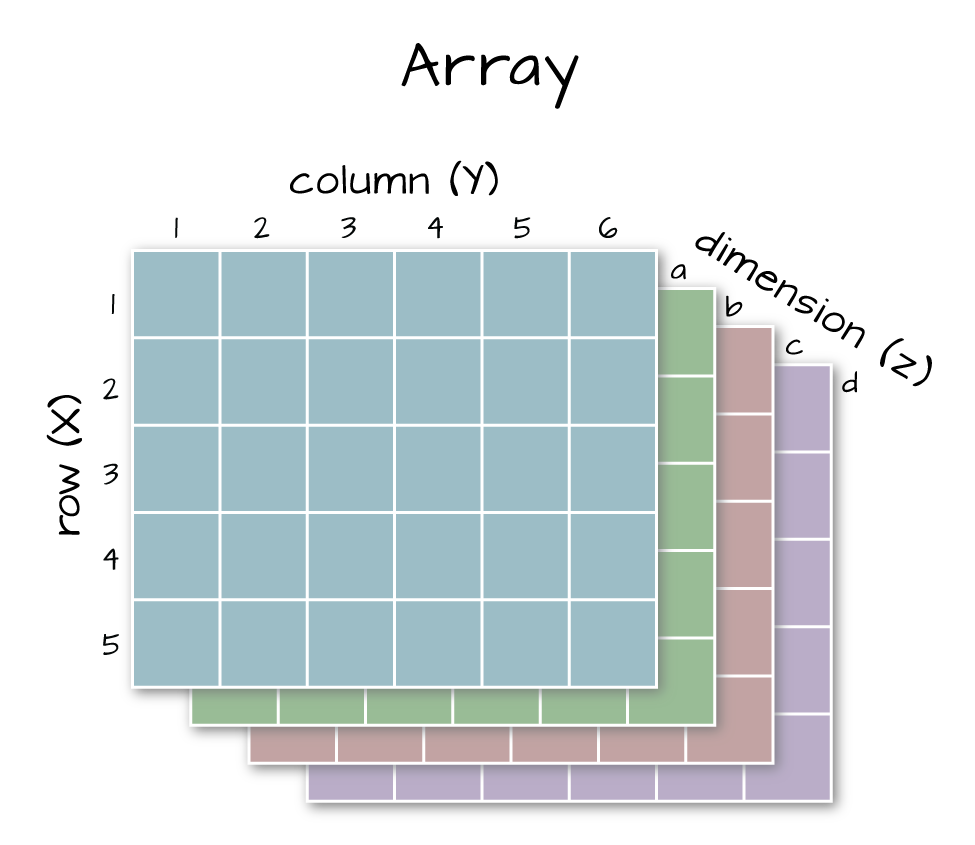

```{r setup, results='hide', message=FALSE}
# The first line sets an option for the final document that can be produced from
# the .Rmd file. Don't worry about it.
knitr::opts_chunk$set(echo = TRUE)

# The next bit (lines 50-69) is quite powerful and useful. 
# First you define which packages you need for your analysis and assign it to 
# the p_needed object. 
p_needed <-
  c("viridis", "knitr", "MASS", "pROC")

# Now you check which packages are already installed on your computer.
# The function installed.packages() returns a vector with all the installed 
# packages.
packages <- rownames(installed.packages())
# Then you check which of the packages you need are not installed on your 
# computer yet. Essentially you compare the vector p_needed with the vector
# packages. The result of this comparison is assigned to p_to_install.
p_to_install <- p_needed[!(p_needed %in% packages)]
# If at least one element is in p_to_install you then install those missing
# packages.
if (length(p_to_install) > 0) {
  install.packages(p_to_install)
}
# Now that all packages are installed on the computer, you can load them for
# this project. Additionally the expression returns whether the packages were
# successfully loaded.
sapply(p_needed, require, character.only = TRUE)
```

------------------------------------------------------------------------

# Program for today

In this session, we will learn about **Interpreting our regression results with simulations**.

We will review:

- The (average case) simulation approach.
- Predicted probabilities, predicted observations and first differences.
- Bootstrapped predicted probabilities.
- Observed value approach.

------------------------------------------------------------------------

# Data for today

Today, we will work with the data from a paper by Nathalie Gieger, Simon Lanz, and Catherine de Vries published in 2020 in PSRM. Here is the abstract:


I of course recommend to read the paper, but here is the tl;dr to give you the main ideas for today's session.

Gieger et al. want to study whether candidates in legislative elections do constituency work because they are intrinsically or extrinsically motivated. Constituency work refers to different kinds of interactions with constituency, e.g. responding to requests by voters. Gieger et al. ask whether candidates do this because they think that this is generally important (intrinsic motivation), or because they hope that they benefit from this, e.g. because the people they interact with may become more likely to vote for them (extrinsic motivation).

  - **Extrinsically motivated constituency work**: Interact with constituents only so that they vote for me.
  - **Intrinsically motivated constituency work**: Interact with constituents because this is an important part of my job.
    
To learn about the motivation, Gieger et al. set up a field experiment where they send out (fake) requests by (fake) voters to see whether candidates react to those requests. Each candidate gets a request from one of two types of voters:

  - **In-canton condition**: The request comes from somebody who resides in the electoral district of the candidate and is thus a potential voter.
  - **Out-canton condition**: The request comes from somebody who resides outside the electoral district of the candidate and thus cannot possibly vote for the candidate. 
    
The rational is that intrinsically motivated candidates would react to both sorts of requests while extrinsically motivated candidates do only react to requests from persons who reside in their electoral district.

Let's have a look at the data:

```{r}
load("raw_data/gieger_et_al.Rdata")

head(data)
```

The dependent variable is whether candidates answer the request (`answer_r`). Our independent variable of interest is `treatment_cant_r`, indicating whether the variable comes from a person who resides in or outside the candidate's district. We then will be working with this model:

$$
\text{Candidate Response}_i \sim Bernoulli (\pi_i) \\
\pi_i = \dfrac{{\exp(\mu_i)}^{}}{{1 + \exp(\mu_i)}} \\
\mu_i = X_i\beta 
$$

The dependent variable is binary. To estimate an appropriate model, let's start with our log-likelihood function for logit models from last week. I added something to make our Log-Likelihood Function for the Logit model a bit smarter:

```{r}
ll_logit <- function(theta, y, X) {
  
  # Making the function smarter
  if (!all(X[, 1] == 1)) {
    X <- cbind(1, X)
  }
  if (!is.matrix(X)) {
    X <- as.matrix(X)
  }
  
  # theta consists merely of beta (dim is ncol(X))
  beta <- theta[1:ncol(X)]
  
  # linear predictor; make sure that X is stored as.matrix
  mu <- X %*% beta
  
  # response function
  p <- 1 / (1 + exp(-mu))
 
  # log-likelihood
  ll <- y * log(p) + (1 - y) * log(1 - p)
  
  # sum
  ll <- sum(ll)
  
  return(ll)
}
```

## Estimating a logit model

We replicate model 4 from the paper. This is their most comprehensive model. It includes an interaction term between the in-canton treatment condition and candidates' electoral safety, as well as control variables.

Note that there is a slight difference between our model and the one in the paper: They use a so-called multi-level model, which accounts for the fact that candidates are nested within electoral districts. We will learn about this in week 12. This changes the estimation results only marginally, so for now we do not need to care about this.

```{r}
# Define variables
y <- data$answer_r

data$treat_safety_inte <- data$treatment_cant_r*data$safety

independent_vars <- c("treatment_cant_r",
                      "treatment_party_r",
                      "safety",
                      "treat_safety_inte",
                      "age",
                      "male_r",
                      "party1",
                      "party2",
                      "party4",
                      "party5",
                      "lang_r")

X <- as.matrix(data[, independent_vars])

# start values
startvals <- rep(0, ncol(X) + 1)

# optimize
res <- optim(
  par = startvals,
  fn = ll_logit,
  y = y,
  X = X,
  control = list(fnscale = -1),
  hessian = TRUE,
  method = "BFGS"
)

# Parameters 
res$par

# Variance-Covariance Matrix
varcov <- solve(-res$hessian)

# Standard Errors
sqrt(diag(solve(-res$hessian)))
```

# Getting started with simulations.

Simulations are all about enabling us to better interpret and communicate our results! Most (but not all) of you should know this procedure really well by now. It is really important to communicate results, so we go through it step by step! 

What are...

* ... **Expected Values**?
* ... **Predicted Probabilities**?
* ... **Predicted Values**?


We start with **Predicted Values**. To get predicted values, four steps are necessary.

## Step 1: Simulate Estimation Uncertainty

```{r Simulate Estimation Uncertainty}

nsim <- 1000

set.seed(1234)

# Set up the sampling distribution
S <- mvrnorm(nsim, res$par, varcov)

# We can plot the simulated sampling distribution
hist(
  S[, 2],
  main = expression(paste("Histogram of Simulated ", beta[1])),
  xlab = "Coefficient",
  las = 1,
  col = "lightgrey",
  border = "white"
)
abline(v = res$par[2], 
       col = viridis(1), 
       lwd = 2)
```

We can also take a look at the joint distribution of two parameters. E.g. the joint simulated distribution of the intercepte and $\beta_1$.

```{r}
plot(x = S[,1], 
     y = S[,2],
     pch = 19,
     col = viridis(1, 0.5),
     las = 1,
     xlab = expression(paste("Simulated Values for ", beta[0])),
     ylab = expression(paste("Simulated Values for ", beta[1])),
     main = expression(paste("Joint simulated distribution of ", beta[0], " and ", beta[1])))
```

We can see that those are (negatively) related. Let's check the variances and the covariance and compare it to our variance-covariance matrix.

```{r}
# values from the estimated variance-covariance data from above 
varcov[1:2, 1:2]

# covariance in simulated coefficients
cov(S[,1], S[,2])

# variance in simulated coefficients
var(S[,1])
var(S[,2])
```


## Step 2: Choose Interesting Scenario

We could for example set all covariates to the sample mean (or median). 

We will compare two scenarios: Candidates who received requests by voters from *within* their district (in-canton) and candidates who received requests from voters from *outside* their district (out-canton).

```{r Choose Interesting Scenario}

# Set interesting Covariate Values
scenario_in_canton <- cbind(1, # constant
                            1, # treatment_cant_r
                            0, # treatment_party_r
                            mean(data$safety), # safety
                            1*mean(data$safety), # interaction
                            mean(data$age), # age
                            1, # male
                            0,0,0,0, # party dummies
                            1) # lang_r

scenario_out_canton <- cbind(1, # constant
                             0, # treatment_cant_r
                             0 , # treatment_party_r
                             mean(data$safety), # safety
                             0*mean(data$safety), # interaction
                             mean(data$age), # age
                             1, # male
                             0,0,0,0, # party dummies
                             1) # lang_r
```

## Step 3: Get Systematic Component

This already gives us **predicted probabilities** (in our case the probability of answering a request conditional on the scenarios).

```{r Get Systematic Component}
# Calculate mu and p

# The linear component
mu_in <- S %*% t(scenario_in_canton)
mu_out <- S %*% t(scenario_out_canton)

# The response function
p_in <- 1 / (1 + exp(-mu_in))
p_out <- 1 / (1 + exp(-mu_out))

# Have a look at the simulation results
mean(p_in)
mean(p_out)

sd(p_in)
sd(p_out)

# let's plot the distributions

par(mfrow = c(1, 2))

hist(
  p_in,
  breaks = 20,
  las = 1,
  col = "lightgrey",
  border = "white",
  main = "Histogram of Simulated Predicted Probabilities",
  cex.main = 0.7,
  xlab = "Pr(answer | in-canton)",
  xlim = c(0.5, 1)
)

hist(
  p_out,
  breaks = 20,
  las = 1,
  col = "lightgrey",
  border = "white",
  main = "Histogram of Simulated Predicted Probabilities",
  cex.main = 0.7,
  xlab = "Pr(answer | out-canton)",
  xlim = c(0.5, 1)
)
```


## Step 4: Simulate Fundamental Uncertainty

```{r Simulate Fundamental Uncertainty}
set.seed(1234)

# Take draws from the appropriate stochastic component
Y_pred_in <- rbinom(n = nsim, 
                    size = 1, 
                    prob = p_in)

Y_pred_out <- rbinom(n = nsim, 
                     size = 1, 
                     prob = p_out)

table(Y_pred_in)
table(Y_pred_out)
```

So what do we do with this? We can now formulate an interpretation of the results, that gives readers a very concrete idea about their substantive meaning:

> Our simulation shows that an average candidate[^1] who receives a request by a person from within their electoral district will answer this request with a probability of `r round(mean(p_in)*100)`% (SE = `r round(sd(p_in)*100)` percentage points). In our simulation, `r sum(Y_pred_in)` out of 1000 candidates responded to such a request (not exactly 81% due to simulation uncertainty, but we could do this more often to look at the distribution of this proportion). 

> The same average candidate who receives a request by a person from outside their electoral district will answer the request with a probability of `r round(mean(p_out)*100)`% (SE = `r round(sd(p_out)*100)` percentage points). In our simulation, `r sum(Y_pred_out)` out of 1000 candidates responded to such a request. Those are `r sum(Y_pred_in)-sum(Y_pred_out)` responses less than from those who received requests from within their canton.

[^1]: We set all continuous variables to their means (age = 47 and safety = 62), and categorical variables to their modes (party = party 1, male = yes, language = german).


## Wrap it all in a function

Since we will be using this quite often, it is helpful to wrap it all in a function.

**What inputs do we need?**
**What should the output be?**

```{r Simulation function}

response_function <- function(x) {
  1 / (1 + exp(-x))
}

stochastic_component <- function(ndraws, p) {
  rbinom(n = ndraws, size = 1, prob = p)
}

sim_function <-
  function(seed = 1234,
           nsim = 1000,
           coefs,
           vcov,
           scenario,
           response_function,
           predicted_values = F,
           stochastic_component) {
    if (is.null(dim(scenario))) {
      stop("The scenario needs to be in a matrix.")
    }
    
    if (length(coefs) != ncol(scenario)) {
      stop("The scenario and the parameter vector don't fit.")
    }
    
    set.seed(seed)
    
    # Set up the sampling distribution
    S <- mvrnorm(nsim, coefs, vcov)
    
    # Calculate mu and p
    
    # The linear component
    mu <- S %*% t(scenario)
    
    # The response function
    ev <- response_function(mu)
    
    if (predicted_values) {
      pv <-
        array(stochastic_component(ndraws = prod(dim(ev)), p = ev),
              dim = dim(ev))
      return(list(ev = ev, pv = pv))
    }
    return(list(ev = ev))
    
  }

```

## Replicate Figure 4 from Gieger et al (2020)

Ok this is cool, but Gieger et al. want to learn more:

  1. Are politicians more willing to respond to voters who reside inside their canton as compared to voters who reside outside their canton? (we answered that)
  2. Does the willingness to respond to both types of voters depend on their electoral safety?
  
We have seen their model coefficients. Now we can use our function simulate and plot predicted probabilities, that give us answers to those two questions.


```{r}
# We want predicted probabilities over a range of values
# for electoral safety

safety_seq <- seq(min(data$safety[!is.na(data$safety)]), 150, 
                  length.out = 100)

# and we want to compare predicted probabilites for answers
# regarding voters from inside and outside the canton

scenario_treatment <- cbind(1, # constant
                            1, # treatment_cant_r
                            0, # treatment_party_r
                            safety_seq, # safety
                            1*safety_seq, # interaction
                            mean(data$age), # age
                            1, # male
                            0,0,0,0, # party dummies
                            1) # lang_r

scenario_control <- cbind(1, # constant
                          0, # treatment_cant_r
                          0 , # treatment_party_r
                          safety_seq, # safety
                          0*safety_seq, # interaction
                          mean(data$age), # age
                          1, # male
                          0,0,0,0, # party dummies
                          1) # lang_r

# this is everything we need for our simulation

sim_treatment <- sim_function(coefs = res$par, 
                              vcov = solve(-res$hessian), 
                              scenario = scenario_treatment, 
                              response_function = response_function, 
                              stochastic_component = stochastic_component)$ev

sim_control <- sim_function(coefs = res$par, 
                            vcov = solve(-res$hessian), 
                            scenario = scenario_control, 
                            response_function = response_function, 
                            stochastic_component = stochastic_component)$ev

```

Let's plot the results! We will follow the aesthetics used in the original article.

```{r}
par(mfrow = c(1, 2))

# We start with predicted probabilities for treatment and control group

plot(x = safety_seq,
     y = apply(sim_treatment, 2, mean),
     type = "n",
     lwd = 2,
     main = "Predicted probabilities", 
     cex.main = 0.7,
     xlab = "Electoral safety",
     ylab = "Pr(answer)", 
     ylim = c(0.4, 1), 
     cex.axis = 0.7, 
     cex.lab = 0.7,
     xaxt = "n")
axis(1, at = seq(0, 150, by = 25),
     cex.axis = 0.7)

# Add a background grid
abline(h = seq(0.4, 1, by = 0.1), 
       col = "grey90")
abline(v = seq(0, 150, by = 25), 
       col = "grey90")

# Predicted Probabilities for treatment and control group
lines(x = safety_seq,
      y = apply(sim_treatment, 2, mean),
      lwd = 2)

lines(x = safety_seq,
      y = apply(sim_control, 2, mean),
      lwd = 2)

# some annotations
text(x = c(5, 5), 
     y = c(0.52, 0.75), 
     labels = c("Out-canton", "In-canton"), 
     cex = 0.7,  
     pos = 4)

# add distribution of actual observations
rug(jitter(data$safety[data$safety<=150], 0.1), ticksize = 0.02, lwd = 1)

# Next, we calculate and plot the first difference
# this time we also want to see the uncertainty

fd <- sim_treatment - sim_control

plot(x = safety_seq,
     y = apply(fd, 2, mean),
     type = "n",
     lwd = 2,
     main = "First difference (in-canton vs. out-canton)", 
     cex.main = 0.7,
     xlab = "Electoral safety",
     ylab = "FD", 
     ylim=c(-0.4, 0.6), 
     cex.axis = 0.7, 
     cex.lab = 0.7,
     xaxt = "n")
axis(1, at = seq(0, 150, by = 25),
     cex.axis = 0.7)

# Background Raster
abline(h = seq(-0.4, 0.6, by = 0.2), 
       col = "grey90")
abline(v = seq(0, 150, by = 25), 
       col = "grey90")

# FD
lines(x = safety_seq,
      y = apply(fd, 2, mean),
      lwd = 2)

# Confidence Intervals
lines(x = safety_seq,
      y = apply(fd, 2, quantile, 0.025),
      lty = "dashed")
lines(x = safety_seq,
      y = apply(fd, 2, quantile, 0.975),
      lty = "dashed")

# vertical line at y = 0
abline(h = 0, 
       lwd = 1)
```

Can you interpret this figure?


# Use bootstrapping to get predicted probabilities

What can we do if we don't get an (useful) estimate of the variance-covariance matrix and still want quantities of interest?

We can use **Bootstrapping** or use a **Bayesian Posterior** (more on this in week 13).

```{r Remember how to bootstrap?, eval=F}

mle_bootstrap <- function(data, ll_fct, startvals) {
  
  # draw bootstrapped sample
  bs_samp <- data[sample(nrow(data), replace = TRUE),]
  
  # bring data into the right format
  y <- bs_samp[, 1]
  X <- as.matrix(cbind(1, bs_samp[, 2:ncol(data)]))
  
  # estimate model with bootstrapped sample
  res <- optim(
    startvals,
    ll_fct,
    y = y,
    X = X,
    control = list(fnscale = -1),
    method = "BFGS",
    hessian = F
  )
  
  # return estimated parameters
  return(res$par)
}

y <- data$answer_r
X <- as.matrix(data[, independent_vars])

df <- cbind(y, X)

startvals <- rep(0, 12)


set.seed(1234)

bs_res <-
  t(replicate(
    10,                     # this is certainly not often enough, but time...
    mle_bootstrap(
      data = df,
      ll_fct = ll_logit,
      startvals = startvals
    )
  )) # Of course do it more than 10 times... However, it will take some time.

# First Differences from the bootstrap distribution

# Step 2: Set interesting Covariate Values
# we use the same as above, but compute it more efficiently
scenario <- rbind(scenario_in_canton, scenario_out_canton)

# Step 3
# Calculate mu and p
mu <- bs_res %*% t(scenario)
p <- 1 / (1 + exp(-mu))


# Have a look at the bootstrapped results
mean(p[,1])
mean(p[,2])

par(mfrow = c(1, 2))

hist(
  p[,1],
  breaks = 20,
  col = "lightgrey",
  border = "white",
  main = "Histogram of Bootstrapped Predicted Probabilities",
  cex.main = 0.7,
  xlab = "Pr(answer | in-canton)",
  xlim = c(0.5, 1)
)

hist(
  p[,2],
  breaks = 20,
  col = "lightgrey",
  border = "white",
  main = "Histogram of Bootstrapped Predicted Probabilities",
  cex.main = 0.7,
  xlab = "Pr(answer | out-canton)",
  xlim = c(0.5, 1)
)

# Calculate the first difference
fd <- p[,1] - p[,2]

par(mfrow = c(1, 1))
hist(
  fd,
  breaks = 20,
  col = "lightgrey",
  border = "white",
  main = "Histogram of Bootstrapped First Difference",
  cex.main = 1,
  xlab = "First Difference"
)
```


# The Observed Value Approach

Our quantities of interest so far were based on fixed covariates. In other words, our scenarios were something like the mean, median or mode (depending on the variable's scale) of all covariates. However, that means that maybe we base our interpretations on cases that do not even exist in the data.

**Why might that be the case?** 

Luckily, there is another approach: the observed value approach. Contrary to the average case approach, we can also simulate quantities of interest for all cases and then get the average afterwards.  

In short, 

- for the **average case approach** you set all covariates to their respective mean and get simulated expected values (or predicted values or first differences or whatever you like) for this "average-case". 
- for the **observed value** approach you simulate expected values (or predicted values or first differences...) for all observations and then calculate the mean of these.

**What could be a downside of this approach?**

Let's get started by comparing the two approaches:

```{r}
# let's start by estimating our model again

y <- data$answer_r
X <- as.matrix(cbind(1, data[, independent_vars]))

# start values
startvals <- rep(0, ncol(X))

res <- optim(
  par = startvals,
  fn = ll_logit,
  y = y,
  X = X,
  control = list(fnscale = -1),
  hessian = TRUE,
  method = "BFGS"
)

res$par
```


```{r}
# Step 1
# Get coefficients and the variance-covariance matrix for the simulation

mu <- res$par
varcov <- solve(-res$hessian)

nsim <- 1000

# Simulate estimation uncertainty
S <- mvrnorm(nsim, mu, varcov)

# Step 2: Set interesting scenario

# Average Case Approach
# (note that means are not appropriate for all variables here)
acaScenario <- apply(X, 2, mean)

# Step 3: Get linear predictor
acaMu <- S %*% acaScenario
acaP <- 1 / (1 + exp(-acaMu))

hist(
  acaP,
  breaks = 20,
  main = "Histogram of Average Case Predicted Probabilities",
  xlab = "Predicted Probability",
  las = 1,
  col = "lightgrey",
  border = "white"
)


# Step 2 and 3
# Observed Value Approach
ovaMu <- S %*% t(X)
ovaP <- 1 / (1 + exp(-ovaMu))
ovaP <- apply(ovaP, 1, mean)

hist(
  ovaP,
  breaks = 20,
  main = "Histogram of Observed Value Predicted Probabilities",
  xlab = "Predicted Probability",
  las = 1,
  col = "lightgrey",
  border = "white"
)
```

**Why are they different?** 


$$
\frac{1}{1+exp(-E[X])} \neq E [ \frac{1}{1+exp(-X)}] 
$$

Of course, we can use the observed value approach to construct different scenarios by setting some covariate of interest to a specific value for all cases. We will work with arrays here and loops for that. (You could of course also work with lists and apply...) 

**Does the probability of a candidate to respond to requests from voters depend on whether they are of the same party or not?**

We will need two scenarios for that. With the two scenarios we then can calculate first differences.

We will make use of arrays here:



```{r}
# More than one scenario in an array.
# 3D array of dim nrow(X), ncol(X), 2
cases <- array(NA, c(dim(X), 2))

# assign X values to all dimensions of cases 
# ie we get two identical layers of X matrices  
cases[, ,] <- X

# select the columns to adjust for simulation 
sel1 <- which(colnames(X) == "treatment_party_r")
sel2 <- which(colnames(X) == "treat_safety_inte")

# assign 0 to treatment_party_r column in layer 1
cases[, sel1, 1] <- 0
# assign 1 to treatment_party_r column in layer 2
cases[, sel1, 2] <- 1

# assign 0 to interaction column in layer 1
cases[, sel2, 1] <- 0*X[, "safety"]
# assign "safety" value to interaction column in layer 2
cases[, sel2, 2] <- 1*X[, "safety"]

# Loop over the matrices.
val <- matrix(NA, nrow = nsim, ncol = 2)

# for each layer in cases (third dimension)
for(i in 1:2) {
  ev <- sim_function(
      coefs = res$par,
      vcov = varcov,
      response_function = response_function,
      stochastic_component = stochastic_component,
      scenario = cases[,,i],
      predicted_values = F
    )$ev
  
  tmp_val <- apply(ev, 1, mean)
  val[, i] <- tmp_val
}


fd <- val[, 1] - val[, 2]

hist(
  fd,
  breaks = 20,
  main = "Histogram of Simulated OVA First Differences",
  xlab = "First Difference",
  las = 1,
  col = "lightgrey",
  border = "white"
)
abline(v = mean(fd), 
       col = viridis(3)[1])
abline(v = quantile(fd, c(0.025, 0.975)),
       col = viridis(3)[2],
       lty = "dashed")
```


**Could we use apply instead of the loop?**

We can also do it for a range of values. For example, we can simulate predicted probabilities over a range of values for electoral safety (as we did above, but to keep it simpler, we will ignore the treatment condition this time).

## Exercise I: The Observed Value Approach with a range of values

Actually, that is what you will do now.

Here are the steps

  + Pick interesting values of the `safety` variable (earlier we used `safetyseq`, as sequence with `length.out = 100`. For faster computation, let's use `length.out = 20` this time).
  + Set the in- vs. out-canton variable two their two conditions (i.e. zero and one)
  + Create an array object and put the data-matrix of covariates in the list, replace the electoral safety (`safety`) value for all observations by the value of the respective quantile. You might want to use a loop to do this for all of the 10 scenarios.
  
  
This weeks exercise will be a little bit different. The reason is that I rearranged the lab and this exercise turned out to be a little bit too difficult to solve within ~10 minutes. So instead of coding everything up, I provide you with the solution, but ask you to **discuss and understand the code**. In doing so, please provide thorough comments on all parts of the code.
  
```{r Exercise I: OVA for a range of values, eval=F}

## select the columns to adjust in the data 
sel1 <- which(colnames(X) == "safety")
sel2 <- which(colnames(X) == "treat_safety_inte")

## set a sequence of reasonable values for safety variable 
safetyScenario <- seq(0, 150, length.out = 20)

### what are the dimensions of this matrix and why???
## we get an array of dimensions 660, 12, 20: nrow(X), ncol(X), length(safetyScenario)
cases <- array(NA, 
               dim = c(dim(X), length(safetyScenario)))

## assign X into every of 20 dimensions (layers) of the array 
## no difference between layers for now
cases[, ,] <- X

## for each of 20 layers in cases array
## adjust the values for the columns safety and treat_safety_inte,
## to be ith value in safetyScenario
for (i in 1:length(safetyScenario)) {
  cases[, sel1, i] <- safetyScenario[i]
  cases[, sel2, i] <- safetyScenario[i]*X[, "treatment_cant_r"]
}


# empty matrix to store predicted probabilities 
# dimensions are 1000 (nsim) by 20 (values in safetyScenario sequence)
val <- matrix(NA, 
              nrow = nsim, 
              ncol = length(safetyScenario))

## for each layer in cases matrix (ie for each scenario of 
## safetyScenario equal to a value in safetyScenario vector)
for (i in 1:length(safetyScenario)) {
  # to ith column of 20 in val matrix
  val[, i] <-
    # take a row in S matrix from above (draws from mvrnorm)
    apply(S, 1, function(s) 
      # calculate the cases[, , i] %*% rows in S 
      # ie each X with adjusted scenarios %*% each set of simulated beta
      # apply logit transformation and take the mean of all values
      mean(1 / (1 + exp(-cases[, , i] %*% s))))
}
## we just multiplied each layer in cases with each row in S matrix

### get CIs, transpose 
df <- data.frame(t(apply(val, 2, quantile, c(0.975, 0.025))))

### get the mean 
df$mean <- apply(val, 2, mean)

### add the sequence safetyScenario for plotting

df$safety_val <- safetyScenario

names(df)[1:2] <- c("upper", "lower")

plot(x = df$safety_val,
     y = df$mean,
     pch = 19,
     col = viridis(1),
     cex = 1.5,
     ylim = c(0, 1),
     xlab = "Electoral Safety",
     ylab = "Pr(answer)",
     main = "Predicted Probabilities (OVB)",
     cex.axis = 0.8, 
     cex.lab = 0.8,
     cex.main = 0.8,
     las = 1,
     xaxt = "n")
axis(1, seq(0, 150, 25))
segments(x0 = df$safety_val,
         x1 = df$safety_val,
         y0 = df$lower,
         y1 = df$upper,
         col = viridis(1),
         lwd = 2)
```


# Concluding Remarks

Homework 4 is already on github. In your homework you will be once more an expert in civil wars.

* Implement a logit and a scobit model.
* Simulate.
* Check Robustness.
* And most importantly, write an abstract for your final paper project.


